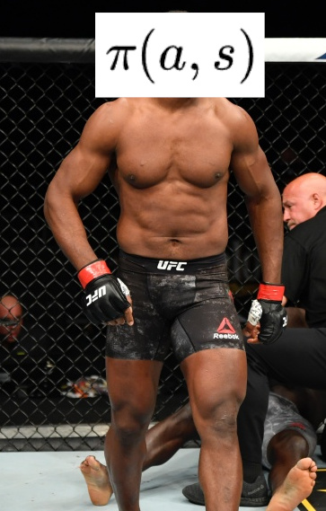

<h1>
   
</h1>

# bagarre IO

_Solve violence, then solve anything else with violence._

**bagarreIO** is a library that provides carefully designed environments to train and compare humanoid AI agents on the challenging task of **1v1 close combat**.

## Installation

### Dependencies
1. gym
2. mujoco

## Environment Description & Fighting rules

Two 17-dof simulated humanoids must rekt each other according to the following principles : 

1. Like in chess, each agent has acces to the whole scene state
2. Agents can strike any body part of the opponent but only with hands and feet.
3. Rewards are distributed depending on 1) striked opponent body part : head typically gives the highest score and hands the lowest and 2) the contact force measured during impact.
4. Standing up is not enforced
5. Note that we may add or modify rules progressively to avoid boring solutions or simulation exploits

## Trained Agents

| Method | Author | snapshot |
|:----|:---:   |:---:|
|SAC self-play w/ guidance loss | Rodrigue Siry | |

## Possible improvements
